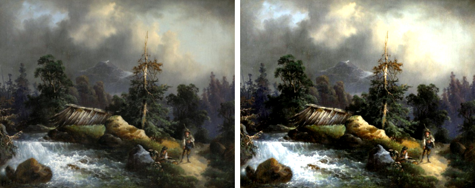

# Color Clip

Color Clip is a [GIMP](https://www.gimp.org/) plug-in that darkens/brightens a given percentage of the darkest/brightest pixels in a drawable.
The drawable can be a layer, layer mask or channel.


## Installation

GIMP 3.0.0 or later is required.

1. In GIMP, locate the folder containing GIMP plug-ins - open GIMP and go to Edit → Preferences → Folders → Plug-Ins. If you cannot locate any of the folders on your system, you can add a custom folder.
2. Copy the `color-clip` folder inside one of the folders identified in step 1. The folder hierarchy should look like this:
    ```
    plug-ins/
        ...other plug-in folders...
        color-clip/
            color-clip.py
            procedure.py
    ```

For Windows, make sure you have GIMP installed with support for Python plug-ins.


## Usage

Open an image in GIMP, select `Colors -> Color Clip...` and adjust the clip percentages as desired.


## Example

Original (left) and with Color Clip applied with 5% white clip and 5% black clip (right):




## License

Color Clip is licensed under the [BSD 3-Clause](LICENSE) license.
